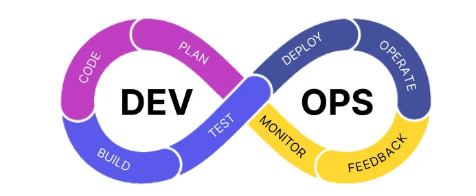
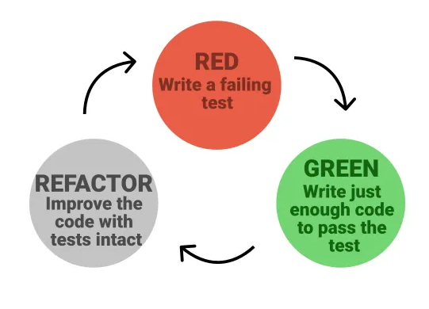

# Hangman Game Project

The purpose of this project is to practice working with Behaviour-Driven Development (BDD), Test-Driven Development (TDD) and Continuous Integration (CI).

### Before You Start

Before you start writing any code, remember that this is a project and you will be graded based on your development process and NOT the finished outcome. Make sure to read through this README so you have a good idea of how to complete this project using BDD, TDD, and CI. To avoid losing any points, make sure you follow the rules below.

**Rules:**

- Do NOT commit & push directly into the master/main branch.
- Do NOT merge broken code into the master/main branch. (*You can still commit & push to your other branches*)
- Do NOT merge into the master/main branch without a pull request.
- Do NOT merge into the master/main branch without a filling out your `pull_request_template.md` file.

<br>

## Design & Planning

This phase utilizes **Behaviour-Driven Development (BDD)** to determine the application's behaviour and fucntionality from the customer's request. For this phase you do not need to add any material, simply read through it to understand the behaviour of this application.

Assume a customer has reached out to you and has offered you lots of money to build them a Hangman Game mobile app. The following is their pitch.

**Customer Request:**

*"I want a mobile app for users to play the classic hangman game. The game should show the user x amount of underscores so they know the length of the word. The user should only be allowed 7 wrong guesses for pole, head, body, arms (x2), and legs(x2) and they should be shown their wrong guesses. If they guess all the right letters before the complete figure is drawn, they win!"*

Upon hearing their request you draft the following user stories.

**User Stories:**

- As a player, I should see *x* amount of underscores, so that I know how many letters are in the hidden word.
- As a player, I should be able to input my letter guess, so that I know if it's correct or incorrect.
- As a player, I should see my correct and incorrect guesses, so that I can avoid repeating the same letter.
- As a player, I should not be allowed to input previous guesses, numbers, nor special characters, so that I don't lose a wrong guess.
- As a player, I should see a win or lose screen towards the end, so that I know if I guessed the word and won or used all my wrong guesses and lost.

Using the above user stories, you draft multiple validation sketches and finally the customer agrees with the sketch below.

**Validation Sketch:**


Messy isn't it? You decide the above validation sketch isn't good enough to serve as your guide, so you quickly draft the low-fidelity prototype below.

**LoFi Prototype:**


From the low-fidelity prototype you create the following Acceptance Criteria.

**Acceptance Criteria:**

- **Given** I am on the Main Screen, **When** I click the "New Game" button, **Then** should be taken to the Game Screen.

<br>

- **Given** I am on the Game Screen, **When** I input a single letter ('a'-'z', 'A'-'Z') **And** the letter is in the hidden word **And** I click the "Guess Letter" button, **Then** I should see the letter within the underscores.
- **Given** I am on the Game Screen **And** I have guessed all letters but one, **When** I input a single letter ('a'-'z', 'A'-'Z') **And** the letter is in the hidden word **And** I click the "Guess Letter" button, **Then** I should be taken to the Win Screen.
- **Given** I am on the Win Screen, **When** I click the "New Game" button, **Then** should be taken to the Game Screen.

<br>

- **Given** I am on the Game Screen, **When** I input a single letter ('a'-'z', 'A'-'Z') **And** the letter is NOT in the hidden word **And** I click the "Guess Letter" button, **Then** I should see the letter amongst my "Wrong Guesses:".
- **Given** I am on the Game Screen **And** I have used 6 of my wrong guesses, **When** I input a single letter ('a'-'z', 'A'-'Z') **And** the letter is NOT in the hidden word **And** I click the "Guess Letter" button, **Then** I should be taken to the Lose Screen.
- **Given** I am on the Lose Screen, **When** I click the "New Game" button, **Then** should be taken to the Game Screen.

<br>

- **Given** I am on the Game Screen, **When** I input a special character (ex: '#','%',..) or number **And** I click the "Guess Letter" button, **Then** I should see an "invalid" message.
- **Given** I am on the Game Screen, **When** I input a more than one letter or character (ex: "abc", "aa") **And** I click the "Guess Letter" button, **Then** I should see an "invalid" message.
- **Given** I am on the Game Screen, **When** I input a previously used letter **And** I click the "Guess Letter" button, **Then** I should see an "already used that letter" message.

<br>

## Testing

This phase utilizes **Test-Driven-Development (TDD)** where we develop our tests first, then we develop the code to simply pass those tests, and lastly we refactor our code to resemble Beautiful Code and our lofi prototype. For this phase you do not need to add any material, simply look through the tests and understand what is happening.

### HangmanGame Unit Tests

Unit tests test individual functions rather than user interaction. Rather than having code that checks the player's letter guesses and game status chaotically spread throughout a dart file, let's put that code into neat functions and a class.

We've decided to put our functions inside a `HangmanGame` class located in the `lib/models/hangmangame.dart` file.

In TDD we write our tests before writing our functions. So, we've created tests for functions we know we'll need.

- A `guess()` function, that determines if a letter guess is *accepted* or not by returning `true` or `false` or throwing an `ArgumentError` if the guess is invalid.
- A `status()` function, that determines if the game is ongoing or completed by returning `'play'`, `'win'` or `'lose'`.
- A `correctGuesses()` function, to help us keep track of our correct guesses by returning them in a string (ex: `'abc'`).
- A `wrongGuesses()` function, to help us keep track of our incorrect guesses by returning them in a string (ex: `'def'`).
- A `blanksWithCorrectGuesses()` function, to help us organize our underscores and guessed letters.
- A `word()` function, to return the hidden word.

**Examples:**

Guessing a single correct letter from our hidden word.

```dart
    // pass in the secret word
    var game = HangmanGame('banana');

    bool wasAbleToMakeGuess = game.guess('b'); // returns true
    print(game.blanksWithCorrectGuesses()) // returns 'b-----'
    print(game.status()) //returns 'play' 
```

Guessing a single correct letter that appears multiple times in our hidden word.

```dart
    var game = HangmanGame('banana');

    print(game.blanksWithCorrectGuesses()) // returns '------'

    game.guess('b'); // returns true
    game.guess('n'); // returns true

    print(game.blanksWithCorrectGuesses()) // returns 'b-n-n-'
    print(game.correctGuesses()) // returns 'bn'
```

Guessing all the correct letters in our hidden word and winning the game.

```dart
    var game = HangmanGame('car');

    print(game.status()) // returns 'play'

    // returns true
    game.guess('c');
    game.guess('a');
    game.guess('r');

    print(game.correctGuesses()) // returns 'car'
    print(game.wrongGuesses()) // returns ''
    print(game.status()) // returns 'win'
```

Guessing a wrong letter, guessing the same letter multiple times, and guessing an invalid letter.

```dart
    var game = HangmanGame('car');

    game.guess('car'); // trhows ArgumentError
    game.guess('%'); // trhows ArgumentError

    game.guess('z'); // returns true

    game.guess('a'); // returns true
    game.guess('a'); // returns false 

    print(game.correctGuesses()) // returns 'a'
    print(game.wrongGuesses()) // returns 'z'
    print(game.status()) // returns 'play'
```

Use the following command to run the unit tests.

**Terminal:**

```console
flutter test test/unit_test.dart
```

**In VS Code:**

1. Open the test/unit_test.dart file
2. While in the test/unit_test.dart file
3. Select the Debug menu
4. Click the Run Without Debuging option

### Hangman Integration Tests

At a highlevel the integration test works like how a user would interact with the app.

They will make sure our player can go from the Main Screen to the Game Screen and play the game. We know the game logic works because of our unit test now we need to test that the UI shows this interactions as the user plays and tries diffrent cases. The integration test runs various cases like inputting correct, wrong, duplicate, invalid guesses. As well as testing the flow from the Game Screen to Win or Lose Screen.

Use the following command to run the integration tests.

**Terminal:**

If running on your local computer.

```console
flutter test test/integration_test.dart
```

If running in Codespaces.

```console
flutter test integration_test/integration_test.dart
```

**In VS Code:**

1. Open the test/integration_test.dart file
2. While in the test/integration_test.dart file
3. Select the Debug menu
4. Click the Run Without Debuging option

<br>

## Code Implementation

In this phase is where you start writing code!

However, before you start writing any Dart code, make sure you utilize **Continuous Integration (CI)** when updating your GitHub repository. CI is one of the 2 phases of **DevOps** and it focuses on updating your source code in a way that almost 100% prevents Regression.



The first step of CI is to setup your **Configuration-as-Code (CaC)**, this step is where you configure your code repository to enforce the CI pipeline.

### Configuration-as-Code

This step has been partly setup for you. Your current repository already has a `.github/workflows/flutter_test.yaml` file that forces GitHub to run all of your tests when a Pull Request is made, and a `pull_request_template.md` file where you can put a description of your Pull Request.

The only thing that's missing is setting up a **Branch Protection Rule** that instructs GitHub not to allow any changes to the `main/master` branch unless it's through a Pull Request.

### Pull Requests

A pull request is when you request to merge the commits from one branch into another. For this project all of your changes should be done on another branch and NEVER directly on the `main/master` branch.

**Creating a new branch:**

**Pushing a new branch:**

**Creating a pull request**, look at your PowerPoint slides for this part.

### Start Your Project!

Since this project relies on TDD, focus first on passing your tests using the Fail -> Pass -> Refactor lifecycle. Start with your unit tests first and then move on to the integration tests. Remember, start from bottom up, lower-level tests to higher-lever tests.



When writing code to pass your tests, make sure to also look at your BDD Acceptance Criteria and Prototypes for guidance if needed.

Once you have written code that passes your tests, update your GitHub repository using CI.


